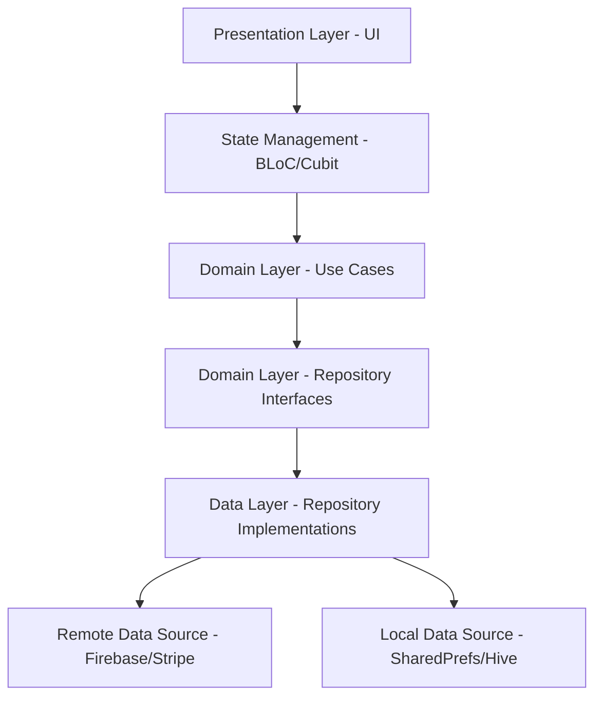

# QuickBite - Food Delivery Application 🍔🛵


A complete production-ready full-stack food delivery application with real-time tracking, multi-role support, and modern UI/UX using Material 3.

---

## 📱 App Roles & Screenshots

### 🧑‍💼 Role 1: Customer App
The customer app allows users to browse restaurants, add items to the cart, check out via Stripe, and track their delivery in real-time.
*(Screenshots placeholder: Customer Home, Restaurant Menu, Checkout, Live Tracking)*

### 🏪 Role 2: Restaurant Dashboard
The restaurant dashboard allows restaurant owners to accept/reject orders, manage menu items, and view daily revenues.
*(Screenshots placeholder: Order Incoming, Dashboard, Menu Management)*

### 🛵 Role 3: Delivery Driver App
The driver app provides drivers with delivery requests, turn-by-turn navigation, and an earnings dashboard.
*(Screenshots placeholder: Driver Home, Delivery Map, Earnings)*

---

## 🏗️ Architecture

The app uses **Clean Architecture** combined with **Feature-first** folder structure and **BLoC** for state management.



---

## 🔥 Firebase Setup Guide

1. Create a new Firebase project at [Firebase Console](https://console.firebase.google.com/).
2. Enable **Authentication** (Phone Number, Google Sign-In).
3. Enable **Firestore Database** and **Firebase Storage**.
4. Install the FlutterFire CLI: `dart pub global activate flutterfire_cli`
5. Run the configuration command in the root of your project:
   ```bash
   flutterfire configure
   ```
6. Deploy the Firestore Security Rules & Indexes based on the collections below.

### Firestore Collections Structure
- `users/{uid}`: role, name, phone, address, profilePhoto
- `restaurants/{id}`: name, cuisine, rating, deliveryTime, isOpen, location (GeoPoint)
- `menus/{restaurantId}/items/{itemId}`: name, price, photo, category
- `orders/{orderId}`: userId, restaurantId, driverId, items[], status, timestamps
- `drivers/{uid}`: isAvailable, location (GeoPoint), currentOrderId

---

## ⚙️ Environment Variables Setup

This project uses `--dart-define` and `.env` files for environment configurations.

1. Create a `.env` file in the root directory (do not commit this to version control).
```env
STRIPE_PUBLISHABLE_KEY=pk_test_your_stripe_key_here
GOOGLE_MAPS_API_KEY=AIzaSy_your_google_maps_key_here
```

2. To run the app with environment variables:
```bash
flutter run --dart-define-from-file=.env
```
Or via IDE configurations by passing `--dart-define=STRIPE_PUBLISHABLE_KEY=...`

---

## 🚀 Getting Started

1. Clone the repository.
2. Run `flutter pub get` to fetch dependencies.
3. Setup Firebase and `.env` as described above.
4. Run `flutter run` on your preferred device.

---

## 🔒 Firebase Security Rules

This project includes production-oriented security rules for Firestore and Firebase Storage to ensure that users, restaurants, and drivers only access and modify data relevant to their roles.

### Key Security Features
- **Role-Based Access**: Customers can only place orders for themselves; restaurants can only manage their own orders and menus; drivers can only view available orders and update orders assigned to them.
- **Immutable Fields**: Critical user fields like `role`, `restaurantId`, and `driverId` cannot be modified after user creation.
- **Strict Status Transitions**: Order status can only be updated through logical steps (e.g., `confirmed` → `preparing` → `readyForPickup`).
- **Secure Drivers Data**: Drivers' locations and availability are only visible to the relevant customer and restaurant for an active order.

### How to Deploy Rules

Ensure you have the [Firebase CLI](https://firebase.google.com/docs/cli) installed and initialized.

1. Login to your Firebase account:
   ```bash
   firebase login
   ```

2. Initialize Firebase in your project if you haven't (select Firestore and Storage):
   ```bash
   firebase init
   ```

3. Deploy the rules using the following command:
   ```bash
   # Deploy Firestore rules
   firebase deploy --only firestore:rules

   # Deploy Storage rules
   firebase deploy --only storage
   ```

Alternatively, you can copy the contents of `firestore.rules` and `storage.rules` directly into the "Rules" tab of the Firestore and Storage sections in the [Firebase Console](https://console.firebase.google.com/).
